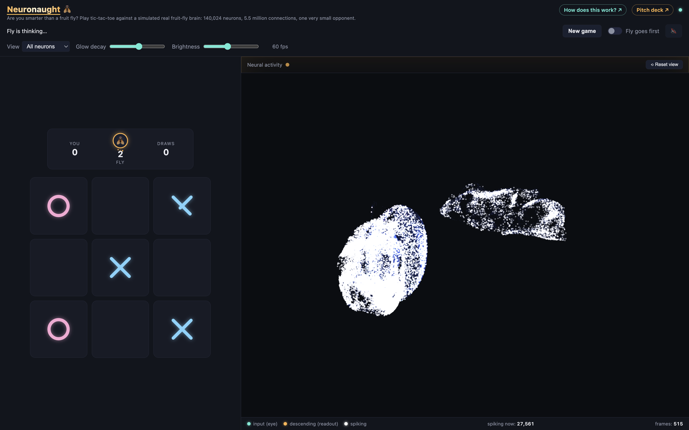

# Neuronaught 🪰

**Are you smarter than a fruit fly?** *Neuron* + *naughts and crosses*.

A real fruit-fly connectome — the **Male CNS v1.0**, released by Janelia FlyEM,
the University of Cambridge, and Google Research — simulated neuron by neuron
on a laptop. Show it a tic-tac-toe board and it picks a move, while you watch
its 140,024 neurons fire in a live, rotatable 3D brain.



*Mid-game. Left: you are X. Right: every dot is one real neuron at its real position; white dots are spiking right now. Open `http://127.0.0.1:8000/?demo=1` to watch the fly play itself.*

## How it works, in 6 lines

1. Your tic-tac-toe board...
2. ...is projected onto the fly's right eye (X = bright spot, O = dark spot).
3. The whole brain runs for 300 ms of simulated brain time.
4. We count spikes from 4,000 especially board-sensitive neurons.
5. A small trained linear readout turns those counts into a score per square.
6. The fly plays the highest-scoring empty square.

## What's real vs. engineered

- Real: the full wiring (140,024 neurons, 5.5M signed synaptic connections), every neuron's real soma position, connection signs from predicted neurotransmitters, and LIF spiking dynamics fit to this connectome by Shiu et al. 2024.
- Real: the retinotopic hex-column addresses used to place the board on the fly's eye.
- Engineered: a global synaptic gain of 2x (at the literature's gain of 1, activity dies out within two synaptic hops — see `docs/TUNING.md`), a coarser 1 ms integration step, and dropped synaptic delays.
- Engineered: the move itself is a linear readout trained purely to play tic-tac-toe, layered on top of the untouched biological network.

## Run it locally

Prerequisites: macOS or Linux, [uv](https://docs.astral.sh/uv/) (it installs
Python 3.12 for you), ~600 MB of disk for the connectome download, 16 GB RAM.
Tested on an Apple M4 MacBook.

```bash
git clone https://github.com/<you>/neuronaught.git && cd neuronaught
uv venv --python 3.12 && uv pip install -e .
uv run python scripts/00_download.py        # 3 files, ~560 MB, public bucket, no account needed
uv run python scripts/01_build_graph.py     # ~3 s  -> data/processed/graph.npz, neurons.npz
uv run python scripts/02_pick_io.py         # <1 s  -> data/processed/io_groups.npz
uv run uvicorn fly.server:app --port 8000   # open http://127.0.0.1:8000
```

That is all you need to play. The three build steps turn the downloaded
connectome into the simulation graph, the neuron positions for the 3D view,
and the eye/readout neuron groups. They are deterministic and take seconds.

### Using the trained fly (included)

The trained readout ships in this repo as `data/processed/readout.npz`
(208 KB): the ridge weights for the 4,000 readout neurons, their
normalisation, the neuron indices, and the simulation settings it was trained
with (300 steps, 1 ms, gain 2, drive 22 mV). The server loads it at startup
and prints `trained=True`. The connectome itself is not in the repo (it is
560 MB and CC-BY from Janelia), which is why the download and build steps
above are still required. You can inspect it with:

```bash
uv run python -c "import numpy as np; d=np.load('data/processed/readout.npz'); print({k: d[k].shape for k in d.files})"
```

### Retraining the fly (optional, ~15 min)

```bash
uv run python -u scripts/03_train_readout.py          # -u so progress lines are not buffered
uv run python -u scripts/03_train_readout.py --regen  # discard cached features and resimulate
```

Training simulates all 4,520 non-terminal boards on 6 processes (~12 min),
caches spike counts in `data/processed/features.npz`, fits ridge readouts,
prints held-out accuracy, overwrites `readout.npz`, then plays 440 evaluation
games. If the server is running it picks up the new readout on the next move.
Simulation settings live in `fly/config.py`; see `docs/TUNING.md` before
changing them, because the readout must be retrained after any change.

### Testing without the data

`uv run pytest` runs the unit tests. `FLY_FAKE_SIM=1 uv run uvicorn fly.server:app`
serves the UI with a fake reservoir, and `http://127.0.0.1:8000/?mock=1` runs
the page with no backend at all.

## Results

- **0.836** optimal-move rate on held-out boards, vs. **0.709** for the same linear model on the raw board with no brain at all.
- **93%** win-or-draw rate against a random opponent.
- **~0.4 s** per fly move (300 ms of simulated brain time, plus streaming).

Full tables and methodology: [`docs/RESULTS.md`](docs/RESULTS.md).

## Learn more

- [`docs/ARCHITECTURE.md`](docs/ARCHITECTURE.md) — file layout, request flow, WebSocket/HTTP protocol, performance
- [`docs/DATA.md`](docs/DATA.md) — connectome files, neuron set, edge thresholds, input/readout selection
- [`docs/MODEL.md`](docs/MODEL.md) — LIF equations, parameters, encoding math, determinism
- [`docs/RESULTS.md`](docs/RESULTS.md) — full results and runtime tables
- [`docs/TUNING.md`](docs/TUNING.md) — the gain/bias sweep and how to retune
- In-app explainer and pitch deck: run the server and visit `/explain.html`

## Credits

Male CNS v1.0 connectome: Janelia FlyEM, University of Cambridge, Google
Research — [male-cns.janelia.org](https://male-cns.janelia.org) (CC-BY). LIF
model: Shiu et al. 2024, *Nature* — [philshiu/Drosophila_brain_model](https://github.com/philshiu/Drosophila_brain_model).
3D viewer: [three.js](https://threejs.org/). Images: Wikimedia Commons (see
`/explain.html` for individual photo/diagram credits). Code is MIT-licensed
(see `LICENSE`); the connectome data is CC-BY and downloaded separately.

Honest caveat: the fly does not know tic-tac-toe. The readout knows; the
brain computes.
